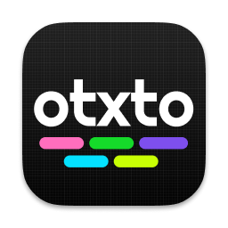

<p align="center">
</p>
<p align="center">a todo.txt compliant kanban & list</p>
<hr>

## Why build this?
there are lots of apps to manage your tasks and normally they are disconnected for your source so they are easy to lose or easy to 

- I wanted to use a human readable format like [todo.txt](https://github.com/todotxt/todo.txt)
- I wanted the data to be program agnostic
- show kanban using [todo.txt](https://github.com/todotxt/todo.txt)
- [single responsibility principle](https://en.wikipedia.org/wiki/Single-responsibility_principle)
- file based storage so I can use syncthing or git

# Get Started

```bash
flutter run -d linux
# flutter run -d macos
# flutter run -d windows
```
Press `r` in the terminal to reload in application

## generate icons

```bash
flutter pub run flutter_launcher_icons

```

# Why did you make this boilerplate?

I made this for myself to help make applications that are: 
- 🎯 [SRP](https://en.wikipedia.org/wiki/Single-responsibility_principle) focused 
- 🚸 Cross platform
- 🛖 Offline first
- 🪣 Offline data sharing with TOML

More information in my blog post: [Bringing back dumb programs](https://blog.stagfoo.com/post/dumb-programs/)


# Whats inside

- 🖼️ UI = MaterialApp
- 🍹 Styles = MaterialApp
- 🍖 Store = Getx
- 🦴 Router = Getx
- 🪣 Storage = TOML


# Screenshots

<p align="center">

</p>

