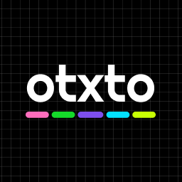

<p align="center">
</p>
<p align="center">a todo.txt complient kanban & todo</p>
<hr>

## Setup Wrapper

```bash
pip install -r requirements.txt 
python3 main.py
```

## Setup Web interface
```
cd chumbucket;
yarn;
yarn start;
```

## Libraries
- chumbucket ui
- todo.txt format

## why would you do such a thing?
- use todo.txt
- show kanban for todo.txt
- Single reponsibility
- file based storage

# Design
https://www.figma.com/file/kewtfv2VTfukgcw07LmO01/APP---otxto?node-id=0%3A1


## Bundling app

```
pyinstaller main.py 
```
builds to dist, copy in www and boom it works