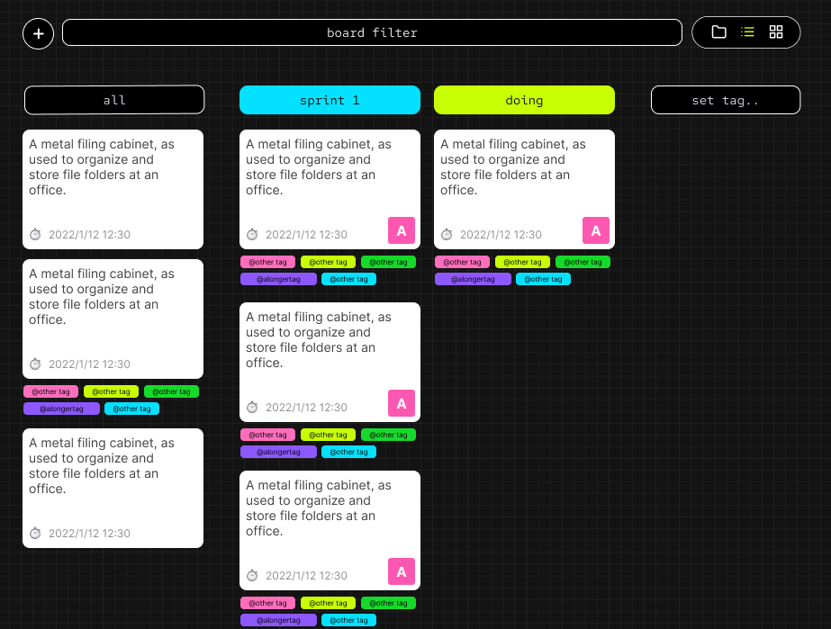

<p align="center">
</p>
<p align="center">a todo.txt compliant kanban & list</p>
<hr>

## why would you do such a thing?
- I wanted to manage my tasks close to my code.
- I wanted to use a human readable format like [todo.txt](https://github.com/todotxt/todo.txt)
- show kanban using [todo.txt](https://github.com/todotxt/todo.txt)
- [single responsibility principle](https://en.wikipedia.org/wiki/Single-responsibility_principle)
- file based storage so I can use tresorit or git

# Screenshots

<p align="center">

<i>saves to txt files after each change</i>
 <br /> <br />

<i>delete using the keyboard shortcut x</i>
 <br /> <br />

<i>show columns based on tags</i>
 <br /> <br />

<i>add tags based on the column</i>
</p>

## Building the from source
building for Linux and windows
```
cd chumbucket;
yarn build;
cd ..;
pyinstaller main.py;
```
building for mac os
```
cd chumbucket;
yarn build;
cd ..;
python3 build-mac.py py2app
```

## Setup Web interface ([chumbucket](https://github.com/stagfoo/chumbucket))
run the development environment, you can replace the url referenced in `webview.create_window` to test inside the wrapper.
```
cd chumbucket;
yarn;
yarn dev;
```

## Setup Desktop wrapper ([fiskabur 🐡](https://github.com/stagfoo/fiskabur))
this will run server whatever is in `webview.create_window` in `main.py`. Native function like opening/saving files can be edited here.

```bash
pip install -r requirements.txt 
python3 main.py
```

## Libraries
- 🖼️ UI = [chumbucket] (https://github.com/stagfoo/chumbucket)
- 🍱 Desktop Wrapper [fiskabur 🐡](https://github.com/stagfoo/fiskabur)
- 🗄️ File format [todo.txt format](https://github.com/todotxt/todo.txt)


# Design

<p align="center">
<br />
<i>list view</i>
  <br />
  <br />
<i>kanban view</i>
</p>


<!-- # alternate Human Readable File Formats might use
- https://toml.io/en/
- https://pypi.org/project/tinydb/ -->

